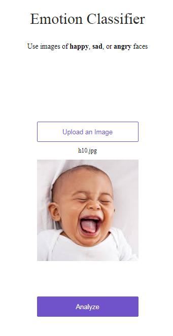

# Emotion Detector
# Midterm Assignment (Build an AI Startup)

The production deployment of the app: https://emotion-detector.onrender.com/

## Team members:
## 1. jmjayashree32@gmail.com (Jayashree)
## 2. choudhury.michael@gmail.com (Michael Choudhury)
## Classification service for identifying emotions on human faces using a simple web app programmed in Python-3.
## ML/DL frameworks used: Fastai computer vision; PyTorch
## How to use the web app?
- ### Choose an image of a happy, sad, or an angry face or use google or take a photo using a smart phone
- ### Save the image to your PC
- ### Upload the image to the app
- ### Click the 'Analyze' button
- ### Read the result

     

# https://emotion-detector.onrender.com/

